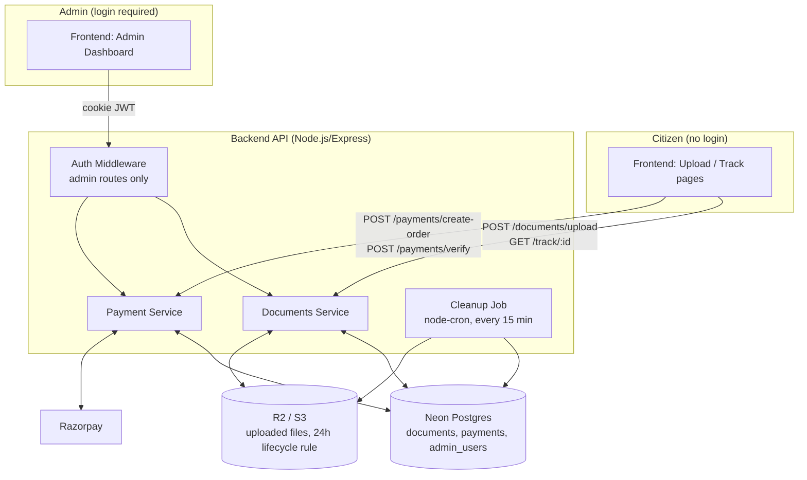
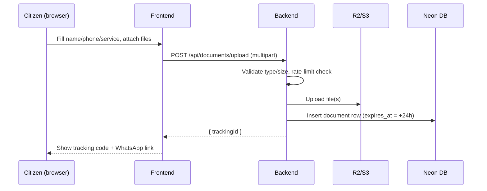
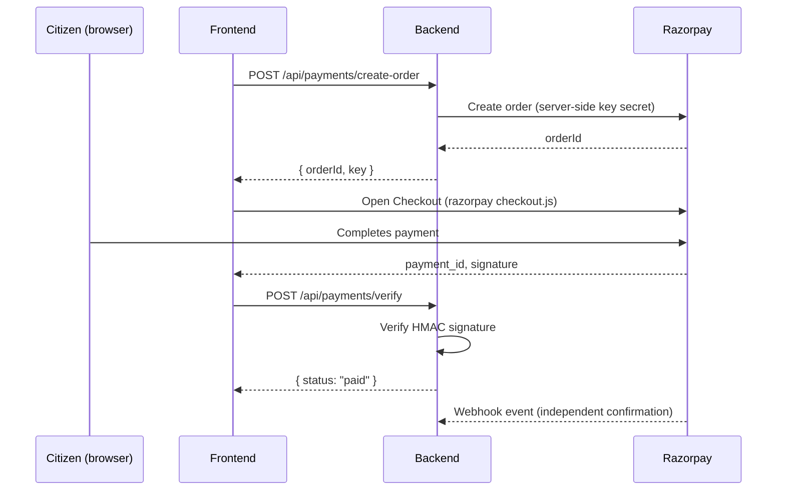
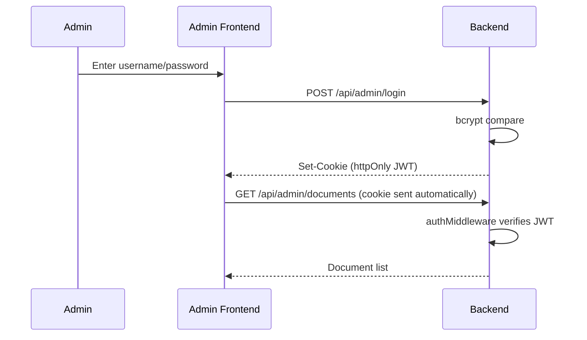
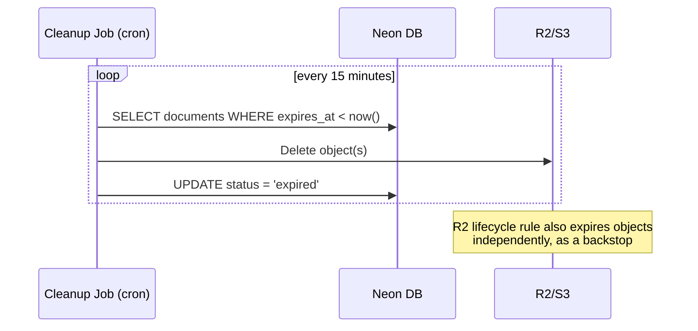

# Architecture — Jeet Digital Seva Kendra

This redraws your whiteboard diagram into the concrete system, plus the flows that matter: upload, payment, admin auth, and the 24-hour purge.

---

## 1. System Diagram

**Key point vs. your sketch:** citizens never touch the admin dashboard or the backend's admin routes at all — there is no login *anywhere* on the citizen-facing side. The only authenticated surface in the whole system is `/admin/*`.

---

## 2. Upload Flow (Sequence)

## 3. Payment Flow (Sequence)

## 4. Admin Auth Flow

## 5. Auto-Purge Flow

---

## 6. Security Model

- **No citizen accounts exist** — this is intentional, so there is nothing to leak or reset. The trade-off is handled by: (a) rate-limiting the anonymous upload endpoint, (b) never exposing a document except via its unguessable `trackingId` + returning only status (not the file) on that public route, and (c) short-lived signed URLs for the actual file, issued only to the authenticated admin.
- **Admin is the only identity in the system.** JWT lives in an httpOnly, `Secure`, `SameSite=strict` cookie — never in localStorage — so it can't be read by injected JS.
- **Bucket is private.** No object is ever publicly readable; the admin dashboard fetches a signed URL good for a few minutes, generated on demand.
- **Documents are ID proofs (Aadhaar, PAN, etc.) — treat them as sensitive by default:** HTTPS everywhere, no file contents in logs, 24-hour hard limit enforced at both the app and storage layer, and an audit trail of admin actions (view/print/delete) rather than of file contents.
- **Payments** are verified server-side via HMAC signature *and* reconciled via Razorpay's webhook — the frontend's "success" callback is never trusted on its own.

## 7. Hosting Topology

| Layer | Recommendation | Reasoning |
|---|---|---|
| Frontend | Vercel / Netlify / Cloudflare Pages | Already static-friendly, cheap, fast CDN for a local business site |
| Backend | Railway / Render / Fly.io | Small always-on Node process; keeps `node-cron` simple |
| Database | Neon (Postgres) | Already chosen; serverless, generous free tier for this scale |
| File storage | Cloudflare R2 | S3-compatible API, **no egress fees** — matters if the admin previews/downloads files often; native lifecycle rules for the 24h auto-expiry |
| Payments | Razorpay | Standard for India |

## 8. Why This Fits a Single Shop

This is deliberately not over-engineered: one Postgres instance, one bucket, one small API process. There's no need for queues, microservices, or a CDN in front of the API at this scale — the cron-based purge and rate limiting are the only "extra" pieces, and both exist specifically because there's no login gate on the upload side.
