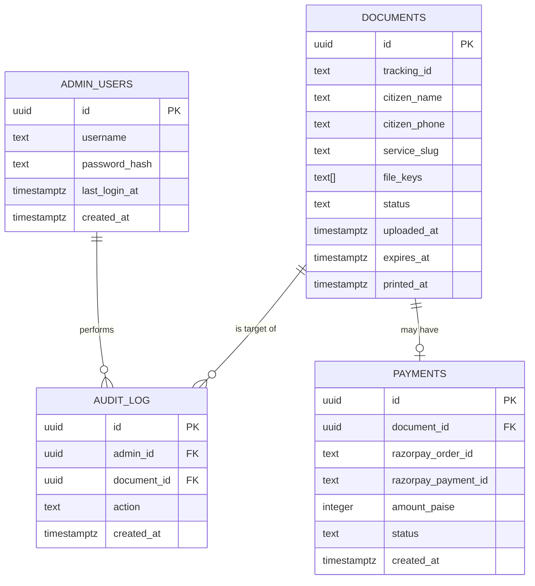

# Database Schema & Storage — Jeet Digital Seva Kendra

Neon (Postgres) for structured data, Cloudflare R2 (S3-compatible) for the actual files.

---

## 1. Entity Relationship Diagram



---

## 2. Table DDL

```sql
create table admin_users (
    id              uuid primary key default gen_random_uuid(),
    username        text unique not null,
    password_hash   text not null,
    last_login_at   timestamptz,
    created_at      timestamptz not null default now()
);

create table documents (
    id              uuid primary key default gen_random_uuid(),
    tracking_id     text unique not null,        -- short human-readable code, e.g. JD-7F3K2
    citizen_name    text not null,
    citizen_phone   text not null,
    service_slug    text not null,
    file_keys       text[] not null,             -- object keys in R2/S3, not public URLs
    status          text not null default 'received'
                        check (status in ('received','printed','expired','deleted')),
    uploaded_at     timestamptz not null default now(),
    expires_at      timestamptz not null,        -- uploaded_at + interval '24 hours'
    printed_at      timestamptz
);

create index idx_documents_expires_at on documents (expires_at) where status != 'expired';
create index idx_documents_phone on documents (citizen_phone);
create index idx_documents_status on documents (status);

create table payments (
    id                    uuid primary key default gen_random_uuid(),
    document_id           uuid references documents (id) on delete set null,
    razorpay_order_id     text not null,
    razorpay_payment_id   text,
    amount_paise          integer not null,
    status                text not null default 'pending'
                              check (status in ('pending','paid','failed','refunded')),
    created_at            timestamptz not null default now()
);

create index idx_payments_status on payments (status);
create index idx_payments_created_at on payments (created_at);

create table audit_log (
    id              uuid primary key default gen_random_uuid(),
    admin_id        uuid references admin_users (id),
    document_id     uuid references documents (id) on delete set null,
    action          text not null,   -- 'viewed' | 'printed' | 'deleted' | 'login'
    created_at      timestamptz not null default now()
);
```

**Retention note:** `documents` rows are purged (files deleted + status set `expired`, then hard-deleted after a short grace window, e.g. 7 days) per the 24-hour policy. `payments` and `audit_log` are **kept indefinitely** (or per your bookkeeping needs) since financial records shouldn't disappear just because the source document did — `document_id` on `payments` simply goes null once the linked document is purged (`on delete set null`).

---

## 3. Storage Design (R2 / S3)

### Key naming convention
```
uploads/{yyyy-mm-dd}/{document-uuid}/{original-filename}
```
Date-prefixing makes lifecycle rules and manual audits easy; the UUID folder keeps files for one document grouped and collision-free.

### Bucket configuration
- **Private bucket** — block all public access. Every read goes through a backend-issued, short-lived (≈5 min) signed URL.
- **Lifecycle rule:** expire (delete) all objects under `uploads/` **24 hours** after creation. This is the storage-level backstop described in the architecture doc — it fires even if the app-level cron job fails for some reason.
- **CORS:** allow `PUT`/`POST` only from your backend's IP/service if you ever move to presigned direct-upload later; for the MVP (backend proxies the upload) bucket CORS can stay locked down entirely.
- **Encryption at rest:** enabled by default on R2/S3 — no extra config needed, but worth confirming in the bucket settings given these are ID documents.

### Why R2 over S3
Same API (the AWS SDK v3 works against R2 with just an endpoint override), but R2 has **no egress fees** — relevant here because every time the admin previews or downloads a document, that's an egress read. For a low-volume single-shop use case this is mostly about avoiding surprise bills, not raw performance.

---

## 4. Cleanup Query (used by the cron job)

```sql
select id, tracking_id, file_keys
from documents
where expires_at < now()
  and status not in ('expired', 'deleted');
```
For each row: delete the objects at `file_keys` from the bucket, then:
```sql
update documents set status = 'expired' where id = $1;
```
A second, less frequent job (e.g. daily) can hard-delete rows that have been `expired` for more than 7 days, if you want the `documents` table itself to stay small and not retain even the metadata (name/phone/service) past a short grace period.
